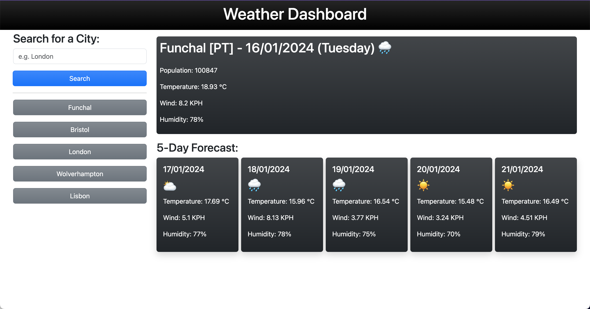

# Weather Dashboard

## Description

For this project I was tasked with creating a weather dashboard which displays the current weather conditions for any city in the world!

There is a main card which will show the population, country code and name of the city as well as the temperature, wind speed and humidity.

Below the main card are additional cards that show up to five days of forecast information. Once you have searched for a city, it will show up in the history section where the same information can be accessed again by clicking that specific city's button.

_Find the link to the the deployed website [here](https://prodigalprogrammer.github.io/weather-dashboard/)_

(<a href="#weather-dashboard" >Back to top</a>)

## Usage

- When the page loads there is an information bar that floats telling you what to expect once a city is searched.
- Search results retrieve a city's information and displays it in place of the information bar.
- Blank entries will not be permitted.
- You will be notified if your city's name is invalid.
- The emoji shown next to each date signifies what type of weather to expect for that day.
- Golden glow around all buttons.
- Dashboard changes depending on screen width.
- Ternary operator determines whether a city is a 'MEGA-CITY' (population over 1 million) or not.
- Nice gradient over all backgrounds including the buttons.
- Information bar is styled and animates upon page loading.

(<a href="#weather-dashboard" >Back to top</a>)

## Features

### jQuery

- A lot of this code is functioning from jQuery, such as:
- `.animate()` which is animating the intro message.
- `.hide()` hides an element.
- `.show()` displays a hidden element.
- `css({})` allowed me to manipulate elements without the need for a seperate css stylesheet.

### LocalStorage

- `localStorage` helped me store the cities that had been searched previously in conjunction with `JSON.parse()` and `JSON.stringify()`.

### For Loop

- Only one for loop was needed on this project.

### Fetch

- Fetch was the basis for this project which allowed me to extract data from the OpenWeatherMap API with my own API key.

(<a href="#weather-dashboard" >Back to top</a>)

## License

Distributed under the MIT License. See `LICENSE.txt` for more information.

## Contact

Project Link: [https://github.com/prodigalProgrammer/weather-dashboard](https://github.com/prodigalProgrammer/weather-dashboard)

Monrone Stewart: [YouTube](https://www.youtube.com/@ProdigalP) - prodigalprogrammer7@gmail.com

(<a href="#weather-dashboard" >Back to top</a>)

## Acknowledgement

- [GitHub Pages](https://pages.github.com/)
- [Bootstrap](https://getbootstrap.com/docs/5.3/getting-started/introduction/)
- [jQuery Documentation](https://api.jquery.com/)
- [OpenWeatherMap](https://openweathermap.org/)
- [Day.js](https://day.js.org/en/)
- [jQuery Animation Tutorial](http://www.java2s.com/Tutorials/Javascript/jQuery_Animation_How_to/Repeat/Repeat_animation.htm)
- [Local Storage Tutorial](https://www.geeksforgeeks.org/how-to-store-an-array-in-localstorage/)

(<a href="#weather-dashboard" >Back to top</a>)

